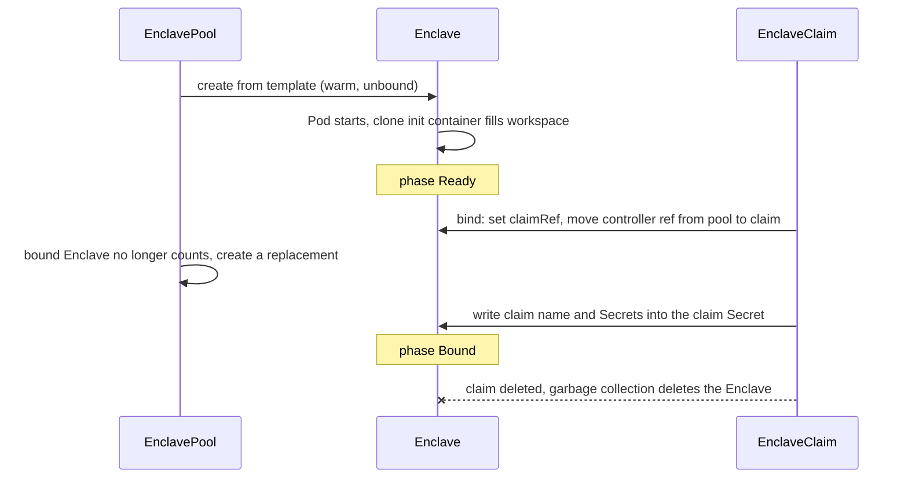

# Design

enclave runs development environments inside a cluster.
An environment is a Pod plus the state around it: a workspace volume, cloned repositories, a ServiceAccount, and Secrets handed over when someone claims it.

## Resources

| Kind           | Role                                                        | Analogy                  |
| -------------- | ----------------------------------------------------------- | ------------------------ |
| `Enclave`      | One environment: a Pod and the objects it owns              | PersistentVolume         |
| `EnclavePool`  | Keeps `replicas` unbound Enclaves warm                      | StorageClass provisioner |
| `EnclaveClaim` | A request for an Enclave from a pool, bound to exactly one  | PersistentVolumeClaim    |

All three are namespaced, and a claim draws only from a pool in its own namespace.

An `Enclave` can be created directly, without a pool or claim.
Its `spec` holds the environment inline, and it runs until deleted.

## Lifecycle

Binding prefers a Ready Enclave, then the oldest unbound one, and creates one from the pool template only when the pool has none.
The bind is one `Update` carrying the resourceVersion the controller listed, so if two claims race for the same Enclave, one gets a conflict and moves on.
The pool deletes surplus or outdated Enclaves with a resourceVersion precondition for the same reason.

Deleting a claim deletes its Enclave, including the workspace.
Enclaves are never returned to the pool, so nothing one claimant wrote reaches the next.

## What a claim can change

A warm Pod has already started when it is claimed, and a running Pod's volumes and environment variables cannot change.
The template therefore fixes the image, repositories, and workspace.
A claim adds only Secrets.

Every container mounts the Enclave's claim Secret, `<enclave>-claim`, at `/var/run/enclave/claim`.
It is empty while the Enclave is warm.
On binding, the claim controller writes `ENCLAVE_CLAIM` (the claim's name) and every key of every Secret in `spec.secretRefs` into it.
The kubelet then updates the mounted files, usually within a minute.

A workload that needs claim-specific input waits for `/var/run/enclave/claim/ENCLAVE_CLAIM` to appear before reading anything else there.
`config/samples/claude-remote-control.yaml` reads it to name the Remote Control session after the claim.

Keys must be unique across a claim's Secrets.
On a duplicate, the first Secret listed wins, and the `SecretsProjected` condition names the conflict.

## Reserved names

An Enclave named `x` owns a Pod `x`, a Secret `x-claim`, a PersistentVolumeClaim `x-workspace` when its workspace has storage, and a ServiceAccount `x` with RoleBindings `x-<hash>` when `spec.serviceAccount` is set.
An Enclave's name is also a label value on those objects, so it is limited to 63 characters.
Pool names are limited to 57 and claim names to 54, so the Enclave names generated from them fit.
If an object the Enclave does not control already holds one of those names, the Enclave reports `Ready=False` with reason `Conflict` and does not adopt it.
The claim controller likewise projects nothing into a claim Secret the Enclave does not control.

The operator adds volumes named `enclave-*` to the template, and mounts at the workspace path and `/var/run/enclave/claim` in every container.
A template volume name with the `enclave-` prefix is rejected on admission.
A container that mounts anything at either path is reported as a `Conflict`, because a CEL rule over every container's mounts exceeds the CRD cost budget.

## Template changes

A pool hashes its template and labels each Enclave with the hash.
Unbound Enclaves with an old hash stay claimable until enough current Enclaves are Ready to meet `replicas`, and are then deleted.
Bound Enclaves are never touched.

Changing a standalone Enclave's environment has no effect on its running Pod.
Delete the Pod to have it recreated from the new spec.

## Repositories

When `spec.repositories` is set, an init container clones each repository into the workspace before the environment starts.
It uses the image from the operator's `--git-image` flag, which must provide `sh` and `git`, and runs as the first container's `securityContext`, so the clones are owned by the user who works in them.
The default image runs as root, so a `securityContext` with `runAsNonRoot: true` also needs an explicit `runAsUser`, at the container or Pod level, for the clone to start.
A repository whose destination already has a `.git` directory is skipped, so a persistent workspace keeps local changes across Pod restarts.

`credentialsSecretRef` takes a `kubernetes.io/basic-auth` Secret (`username`, `password`) or a `kubernetes.io/ssh-auth` Secret (`ssh-privatekey`).

## Security

The operator creates Pods and RoleBindings on behalf of whoever writes an `Enclave` or `EnclavePool`, and holds the `bind` verb on every Role and ClusterRole to do so.
RBAC's own checks see the operator, not the author.
A ValidatingAdmissionPolicy per resource, in `config/policy`, puts the author through the same checks: they need `create` on Pods in the namespace, and `bind` on each Role or ClusterRole in `serviceAccount.roleRefs`.
The check is stricter than RBAC's, which also lets a user bind a role whose permissions they already hold.

The operator's ServiceAccount is exempt, because it writes Enclaves for pools and claims whose authors already passed the policy.
A claim gets the roles its pool's author chose.
The exemption names the ServiceAccount as `system:serviceaccount:enclave-system:enclave-controller-manager`, so a deployment that changes the namespace or name prefix has to change the policies to match.
A deployment without `config/policy` lets anyone who can write an Enclave or EnclavePool bind any role, and anyone who can write an EnclaveClaim read any Secret in its namespace.

Removing `spec.serviceAccount` from an Enclave deletes its ServiceAccount and RoleBindings, which revokes the tokens of the Pod that is still running.

Claim Secrets are copied into a Secret in the Enclave's namespace, which is the claim's namespace.
They do not cross namespaces.
The copy is readable from inside the Enclave, so the claim policy requires the author to hold `get` on each Secret in `spec.secretRefs`.
Without it, anyone who can create an EnclaveClaim could read any Secret in the namespace.

An authorizer check in CEL costs 350k of an expression's 1M budget, so each policy checks one roleRef or Secret per expression.
`roleRefs` and `secretRefs` are capped at 16 items so the checks fit in a policy's 10M budget.
